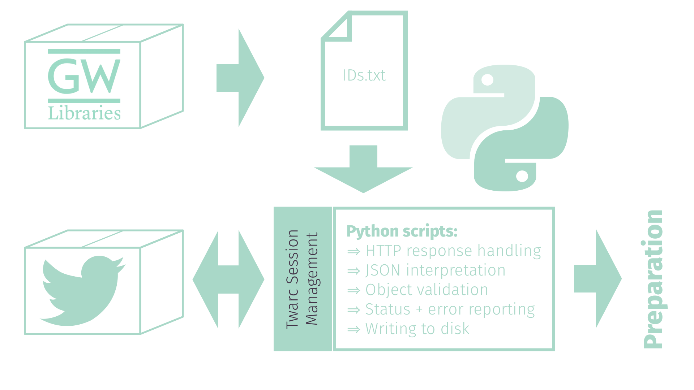
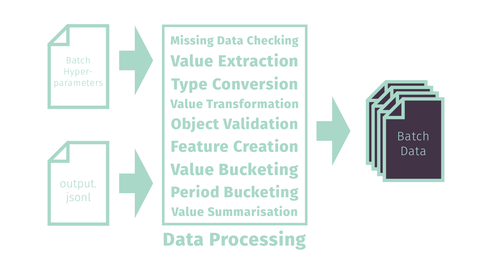

theme: Fira, 2
autoscale: true

# [fit] Insights into **Social Media** Data: 
# [fit] a new formalism inspired in **Thermodynamics**

---

---

[.list: alignment(left)]

## Agenda

1. **Background**
	* Literature and motivation
2. **Methodology**
	* Aims and Objectives
	* Tools and methods used
3. **Findings**
	* Analysis results
	* Discussion

---

# Background
# **

---

[.list: alignment(left)]

# Social Media Usage

* Of the world's ~4.5 billion internet users, **~3.5 billion use social media**1
* From 2005-2015 **social media usage rose 10x** in the US alone2
* **Hundreds of platforms**, growing by the year3, most use two or more4
* Many count users in the millions, with some reaching **> 1 billion users**2
* Social media usage spans demographics5; includes individuals, groups and businesses of all sizes6
* Critical to maintaining a competitive edge in business7
* Has fundamentally **changed the way humanity communicates**8

^ Social media usage has seen some phenomenal growth over the years, with now an approximated more than three-quarters of internet users worldwide being present on social media. 

^ It's had great impact on how we view society, do business and communicate with one another.

---

[.list: alignment(left)]

# Social Media Analysis

* Understand the network structure of platforms, how people connect (**social network analysis**, **behavioural research**)
* Understand the content being generated and shared among platforms, how people react to and propagate it (**content and sentiment analysis**, **information diffusion theories**)
* Understand where particular interest comes from, the determinants and effects of popular topics (**topic analysis**, **trend analysis**)

---

[.list: alignment(left)]

# Challenges

* Social media generates content of **enormous quantity** at great speed10
* **Semi-structured** data that often includes **mixed media** necessary to context11
* Metadata is sparse + **not always accurate**12
* Hardest of **NLP**—jargon, context- + culturally-specific terms13
* **Data is harder to get** over time due to platforms commoditising data14 + increasing privacy controls15

---

# [fit] Trend Analysis & "Prediction"

# 

---

---

[.list: alignment(left)]

# Why? 

* Optimise marketing and outreach campaigns
* Understand content consumption
* Observe cultural change over time
* Jump on bandwagons
* Prevent impending harmful content trends

---

[.list: alignment(left)]

# Challenges

* Subjectivity of viewing, sharing content
* False positives in anomaly detection-based methods16
* Reliance on other information sources in alternative methods17
* Timeliness requirements for analysis and detection18
* Topic evolution over time19
* Predicting the future?

---

---

[.list: alignment(left)]

# Multidisciplinary challenges

* Very human data; erratic behaviours (**behavioural science**)
* Sharing between non-fully-connected graph structure... (**graph theory**)
* ...of nodes with varying levels of transmissiveness (**social contagion**)
* Different content and sentiments get shared in different ways (**information diffusion**)

---

### _"Social media analysis requires some new ways of thinking!"_[^*]

[^*]: see 15, 20-22

---

[.list: alignment(left)]

## Novel cross-disciplinary applications

* Social media trends as contagion theory from **Virology** in Medicine23 - 25
* Social media trends as the **Technology Adoption** curve from Information Diffusion Theory26
* Social media behaviours observed as sound (**Data Sonification**) to aid in anomaly detection27
* Social media network interactions as **Evolutionary Game Theory** from Evolutionary Biology28

---

[.text: #423347]
[.footer: **Source: Mahbub, de Souza and Williams 2016**]
[.footer-style: alignment(left)]

---

## Entropy Theory

---

---

[.list: alignment(left)]

# Entropy over time

* Reveals descriptive statistical measures about a set of data
* But also measures internal diversity and inconsistency
* Takes focus away from upper and lower bounds—or even ranges—in favour of changes in internal distribution that may be more informative
* Is in some cases sufficient to adapt analysis into Markov-model-based prediction

---

## Aims & Objectives

---

[.list: alignment(left)]
[.footer: *In that it could achieve earlier detection than existing early detection methods.]

# Broadly

1. Can the analogous application of **Entropy Theory** present useful information about the lifetime of a trend or topic on a Social Media platform?
2. Is there indication that the method could be applied more broadly, or adapted to be **predictive**?*

---

[.list: alignment(left)]

# In this study

Experimentation aimed to confirm dual hypotheses:

1. **increasing entropy over time** may suggest impending critical interest preceding a trend developing to significance, and
2. **decreasing rate of entropy increase over time** after a high entropy or engagement level has occurred may suggest new evolution in the topic.

---

[.list: alignment(left)]
[.header: alignment(left)]

# This required

* data from social media platforms,
* covering concise topics,
* for significant periods of time, with
* sufficiently varied trend behaviours and
* consistent measures of engagement.

---

# Methodology

# **

---

[.list: alignment(left)]

# Process

1. Identifying Data
2. Retrieving Data
3. Preparing Data
4. Analysing Data

---

## Identifying Data

---

[.list: alignment(left)]
[.text-emphasis: #FFFFFF]

# Twitter!

* Rapid generation of content, rapid decline in interest17 => *easily observable trends*
* Discrete content size easier to analyse29 => *more easily verifiable datasets*
* Breadth of functionality in API, well-established tools for research30 => *easier to get data, perform and recreate studies*

---

## Harvard & GW University researcher verified!

**Selected topics**: Hurricane Florence, Hurricane Harvey, Immigration Travel Ban, Ireland 8th Amendment Vote, Hurricane Irma, Winter Olympics, Women's March

---

## Retrieving Data

---

[.list: alignment(left)]

# "Hydrating" Tweets: Twarc

* made by researchers (from the _Documenting the Now_ project)
* many researchers have used it for studies before, establishing its robustness as a tool31 - 38

---

^ Retrieving Data

---

# Hydration Loss

| **Data Group** | **Listed** | **Hydrated** | **Lost** |
|:---|---:|---:|---:|
| Hurricane Harvey | 18,336,283 | 13,018,265 | 5,318,018 |
| Hurricane Irma | 17,227,935 | 11,627,130 | 5,600,805 |
| Immigration Travel Ban | 16,842,329 | 11,618,463 | 5,223,866 |
| Winter Olympics | 13,787,299 | 10,567,141 | 3,220,158 |
| Hurricane Florence | 7,756,856 | 6,432,696 | 1,324,160 |
| Women's March | 7,263,988 | 4,526,921 | 2,737,067 |
| Ireland Vote | 2,276,808 | 1,784,345 | 492,463 |
| **Total** | **83,491,498** | **59,574,961** | **23,916,537** |

---

## Preparing Data

---

---

[.footer: _"Finally, after literal months of tweaking scripts and babysitting a live data pipeline 24/7, now I just have to confirm my hypotheses!"_]

## Analysing Data

---

[.list: alignment(left)]

# Comparing Distributions

* **Partitioning Data** ⇒ Segmented multiple regression, correlated with significant value thresholding, different bucketing values
* **Assessing Data** ⇒ Conventional descriptive statistics, tests of central tendency, visualisation and exploration
* **Comparing Groups** ⇒ Appropriate non-parametric tests for goodness-of-fit, equal medians, expected variance
* **Manipulating Scales** ⇒ Negating proposed baseline or previous values to assess variation, testing bucketing values

---

# Findings

# **

---

## Identifying periods of significant growth

(Identify point where things change ⇒ identify periods which are significant ⇒ agree where non-significant and significant period meet at an identified point)

---

[.background-color: #ffffff]

---

[.background-color: #ffffff]

---

## It didn't work.

---

## It didn't work.

---

[.header: #423347]
[.text: #423347]
[.footer: Entropy **does** spike as trends begin, but only in **half** of the observed sets, probably only because **sudden volume** spikes internal distribution inconsistency, and even then not in a **consistent** or necessarily **statistically significant** way.]

# Lookback
 

[.background-color: #ffffff]

^ This was a day after I finished fetching a single dataset, before I knew the data well or duplicates were accounted for.

---

[.background-color: #ffffff]

---

[.background-color: #ffffff]
[.header: #423347]

# "Hey what if I tried...?"

---

[.background-color: #ffffff]

---

---

_"...if the facts don’t fit the theory, change the theory. But all too often it’s easier to change the facts."_

---

###  Increased entropy before initial growth
###  Decreased entropy before trend change

---
 
[.list: alignment(left)]
[.header: #423347]
[.text: #423347]
[.background-color: #ffffff]

# Observed generalisations

  

* Entropy **varied significantly** during periods of growth versus not
* Entropy **varied more** during periods of growth
* **Which way** variation went was **inconsistent** between datasets

---

###  Useful patterns beyond the hypotheses

^ It was really kind of soul-crushing, actually.

---

* **Why** didn't it work?
* What does it not working **imply**?

---

[.list: alignment(left)]

# Limitations of pre-existing data

* Start tracking once trend is detected ⇒ **first period often significant** ⇒ little opportunity to precede growth
* Stop tracking once plateaued ⇒ **few secondary growth periods** ⇒ little opportunity to precede change
* Scale not shared between available datasets 

---

[.list: alignment(left)]

# Selected 7 Datasets

* Initial growth periods not at day zero:  **4**
* Secondary growth periods: **1**
 
 
*Is this uncommon on the platforms or just in the pre-existing datasets available?*

---

[.background-color: #ffffff]
[.header: #423347]

# [fit] Data was sparse ⇒ dramatically left-skewed

---

[.list: alignment(left)]

# Entropy

* Range of datapoints
* Volume of datapoints
* Internal distribution

---

[.footer: (And this couldn't be accounted for by removing zero-value observations, as it dramatically reduced data volume, skewed activity metrics and made the values being operated on too small to reach significance)]
[.list: alignment(left)]

# Entropy

* ~~Range of datapoints~~ (made redundant)
* Volume of datapoints (inflated)
* Internal distribution (heavily weighted towards range lower bound)

^ Only dramatic changes in distribution reflected, negating predicted responsiveness

---

[.header: #423347]
[.text: #423347]
[.header-strong: #a9d8c8]
[.background-color: #ffffff]

# Growth could only be determined in the context of **internal** significance

(So it falls down when something like this happens, where a human might say **almost all of this** was significant growth)

---

# 

### **Limited data volume and options ⇒**
#### No ability to compare with non-trending topics, pre- and post-trend behaviours on a greater scale, etc.

---

---

[.list: alignment(left)]

# What is known

* **Engagement behaviour does not work the way it had been assumed** for seven key example trends on Twitter
* There is still need for **computationally inexpensive methods** of gaining insight from social media data
* Cross-disciplinary applications still show promise due to many disciplines having their own foundational methods for **complex data summarisation**
* Entropy Theory is potentially not the solution here, unless **new procedures for data preparation** are developed that negate the skewing effect of sparse data and low medians 

---

[.list: alignment(left)]

# What this study contributed

* A whole bunch of nicely documented Python code, bundled up in an appropriately-licensed **Open Source software** bundle released for public use that is applicable to broader Twitter content analysis.
* Knowledge of many aspects of a method that did not work that now don't need to be tried in the future
* Academic research that illustrates the trend engagement behaviours of these datasets, and to support industry-led reporting of Twitter engagement behaviours
* More examples for future work to cite, justifying interest in analogous methods for social media data analysis or cross-disciplinary application of Entropy Theory
* A conference talk at PyCon Australia that has already **sparked similar work** in the Australian data science community

---

[.list: alignment(left)]

# What experimentation should try next

* Performance may differ in application to **live data** analysis as opposed to retrospective
* Entropy-based analysis may be more useful in **early-stage trend detection** as opposed to the more nebulous ongoing trend behaviour prediction
* Incorporation of **additional information** (if possible) than that available via the Twitter platform API
* Applicability to **other platforms** that may exhibit different content consumption and sharing behaviours

---

# [fit]Thanks for listening!

---

[.text: alignment(left)]

# References

1 Hootsuite: 2018, Hootsuite’s social media barometer report. [https://hootsuite.com/resources/all-future_of_social-digital_in_2019-glo-en-ca-digital_in_2019-q1_2019](https://hootsuite.com/resources/barometer-2018-global?utm_campaign=all-future_of_social-digital_in_2019-glo-en-ca-digital_in_2019-q1_2019) [Accessed 18 May 2018].
2 Perrin, A.: 2015, Social media usage: 2005-2015, _PEW Research Center Report_.
3 Kasemsap, K.: 2019, Professional and business applications of social media platforms, Social Entrepreneurship: Concepts, Methodologies, Tools, and Applications, _IGI Global_, pp. 824– 847.
4 Zhao, X., Lampe, C. and Ellison, N. B.: 2016, The social media ecology: User perceptions, strategies and challenges, _Proceedings of the 2016 CHI conference on human factors in computing systems_, ACM, pp. 89–100. 
5 Kane, G. C.: 2015, Enterprise social media: Current capabilities and future possibilities., _MIS Quarterly Executive_ 14(1). 
6 Kaplan, A. M. and Haenlein, M.: 2010, Users of the world, unite! the challenges and opportunities of social media, _Business horizons_ 53(1), 59–68. 
7 Chui, M., Manyika, J., Bughin, J., Dobbs, R., Roxburgh, C., Sarrazin, H., Sands, G. and Westergren, M.: 2012, The social economy: Unlocking value and productivity through social technologies. [https://www.mckinsey.com/industries/high-tech/our-insights/ the-social-economy](https://www.mckinsey.com/industries/high-tech/our-insights/ the-social-economy) [Accessed 18 May 2019]. 
8 Edosomwan, S., Prakasan, S. K., Kouame, D., Watson, J. and Seymour, T.: 2011, The history of social media and its impact on business, _Journal of Applied Management and entrepreneurship_ 16(3), 79–91.
9 He, W., Shen, J., Tian, X., Li, Y., Akula, V., Yan, G. and Tao, R.: 2015, Gaining competitive intelligence from social media data: evidence from two largest retail chains in the world, _Industrial Management & Data Systems_ 115(9), 1622–1636.
10 Brooker, P., Barnett, J., Cribbin, T. and Sharma, S.: 2016, Have we even solved the first ‘big data challenge?’practical issues concerning data collection and visual representation for social media analytics, _Digital methods for social science_, Springer, pp. 34–50.
11 Mayeh, M., Scheepers, R. and Valos, M.: 2012, Understanding the role of social media monitor- ing in generating external intelligence, ACIS 2012: Location, location, location: _Proceedings of the 23rd Australasian Conference on Information Systems 2012_, ACIS, pp. 1–10. 
12 Halasz, C. M.: 2019, Optimizing training for sparse workloads in Tensorflow. Reinforce AI Conference. **URL**: [https://reinforceconf.com/speaker/CibeleMontezHalasz](https://reinforceconf.com/speaker/CibeleMontezHalasz)
13 Dou, W., Wang, X., Skau, D., Ribarsky, W. and Zhou, M. X.: 2012, Leadline: Interactive visual analysis of text data through event identification and exploration, _2012 IEEE Conference on Visual Analytics Science and Technology (VAST)_, IEEE, pp. 93–102.
14 Hogan, B.: 2016, Social media giveth, social media taketh away: Facebook, friendships, and apis, _International Journal of Communication_, Forthcoming. 
15 Weller, K. and Kinder-Kurlanda, K. E.: 2015, Uncovering the challenges in collection, sharing and documentation: The hidden data of social media research?, _Ninth International AAAI Conference on Web and Social Media_.

---

[.text: alignment(left)]

# References

16 Altshuler, Y., Pan, W. and Pentland, A. S.: 2012, Trends prediction using social diffusion models, International Conference on Social Computing, _Behavioral-Cultural Modeling and Prediction_, Springer, pp. 97–104.
17 Sapountzi, A. and Psannis, K. E.: 2018, Social networking data analysis tools & challenges, _Future Generation Computer Systems_ 86, 893–913.
18 Figueiredo, F., Almeida, J. M., Gon ̧calves, M. A. and Benevenuto, F.: 2016, Trendlearner: Early prediction of popularity trends of user generated content, _Information Sciences_ 349, 172–187. 
19 Qian, S., Zhang, T., Xu, C. and Shao, J.: 2015, Multi-modal event topic model for social event analysis, _IEEE transactions on multimedia 18(2)_, 233–246.
20 Manovich, L.: 2011, Trending: The promises and the challenges of big social data, _Debates in the digital humanities_ 2, 460–475. 
21 Schroeder, R.: 2014, Big data and the brave new world of social media research, _Big Data & 
Society_ 1(2).
22 Sloan, L. and Quan-Haase, A.: 2017, The SAGE handbook of social media research methods, 
Sage.
23 Adar, E. and Adamic, L. A.: 2005, Tracking information epidemics in blogspace, Proceedings of the 2005 IEEE/WIC/ACM international conference on web intelligence, _IEEE Computer Society_, pp. 207–214.
24 Gomez-Rodriguez, M., Leskovec, J. and Krause, A.: 2012, Inferring networks of diffusion and influence, _ACM Transactions on Knowledge Discovery from Data_ (TKDD) 5(4).
25 Cannarella, J. and Spechler, J. A.: 2014, Epidemiological modeling of online social network dynamics, _arXiv preprint arXiv:1401.4208_.
26 Chang, H.-C.: 2010, A new perspective on twitter hashtag use: Diffusion of innovation theory, _Proceedings of the American Society for Information Science and Technology_ 47(1), 1–4.
27 Jamieson, J. and Boase, J.: 2017, Listening to social rhythms: Exploring logged interactional data through sonification, _The SAGE Handbook of Social Media Research Methods_.
28 Liu, F., Wang, L., Johnson, H. and Zhao, H.: 2015, Analysis of network trust dynamics based on the evolutionary game, Scientia Iranica. Transaction E, _Industrial Engineering_ 22(6). 
29 Schmidt, C. W.: 2012, Trending now: using social media to predict and track disease outbreaks.
30 Zimmer, M. and Proferes, N. J.: 2014, A topology of twitter research: disciplines, methods, and ethics, _ASLIB Journal of Information Management_ 66(3), 250–261.

---

[.text: alignment(left)]

# References

31 Milligan, I., Ruest, N. and Lin, J.: 2016, Content selection and curation for web archiving: The gatekeepers vs. the masses, _Proceedings of the 16th ACM/IEEE-CS on Joint Conference on Digital Libraries_, ACM, pp. 107–110.
32 Ruest, N. and Milligan, I.: 2016, An open-source strategy for documenting events: The case study of the 42nd canadian federal election on twitter, _Code4Lib_ 32.
33 Juanals, B. and Minel, J.-L.: 2017, Analysing cultural events on twitter, _International Conference on Computational Collective Intelligence_, Springer, pp. 376–385.
34 Palmer, A., Robinson, M. and Phillips, K. K.: 2017, Illegal is not a noun: Linguistic form for detection of pejorative nominalizations, _Proceedings of the First Workshop on Abusive Language Online_, pp. 91–100.
35 Pinter, A. T., Goldman, B. and Novotny, E.: 2017, Pennsylvania perspectives of the 2016 election: A project to collect web and social media content around significant societal events, _Pennsylvania Libraries: Research & Practice_ 5(2), 96–106.
36 Aruguete, N. and Calvo, E.: 2018, Time to #protest: Selective exposure, cascading activation, and framing in social media, _Journal of Communication_ 68(3), 480–502.
37 Darwish, K.: 2018, To kavanaugh or not to kavanaugh: That is the polarizing question, _arXiv preprint arXiv:1810.06687_ p. 01.
38 Kalmar, I., Stevens, C. and Worby, N.: 2018, Twitter, gab, and racism: the case of the soros myth, _Proceedings of the 9th International Conference on Social Media and Society_, ACM, pp. 330–334.
39 Mahbub, M.S., de Souza, P. and Williams, R., 2017. Describing environmental phenomena variation using entropy theory. _International Journal of Data Science and Analytics_, 3(1), pp.49-60.

---

# [fit] Insights into **Social Media** Data: 
# [fit] a new formalism inspired in **Thermodynamics**

All images are CC0, Pixabay-licensed or my own
See **github.com/TheMartianLife/Honours-Presentation**

