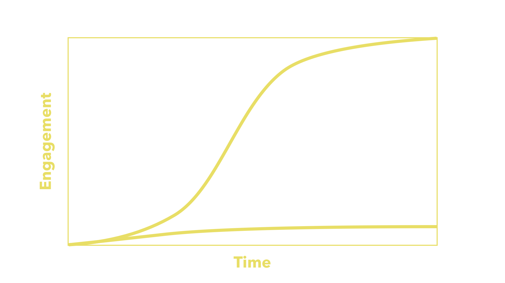
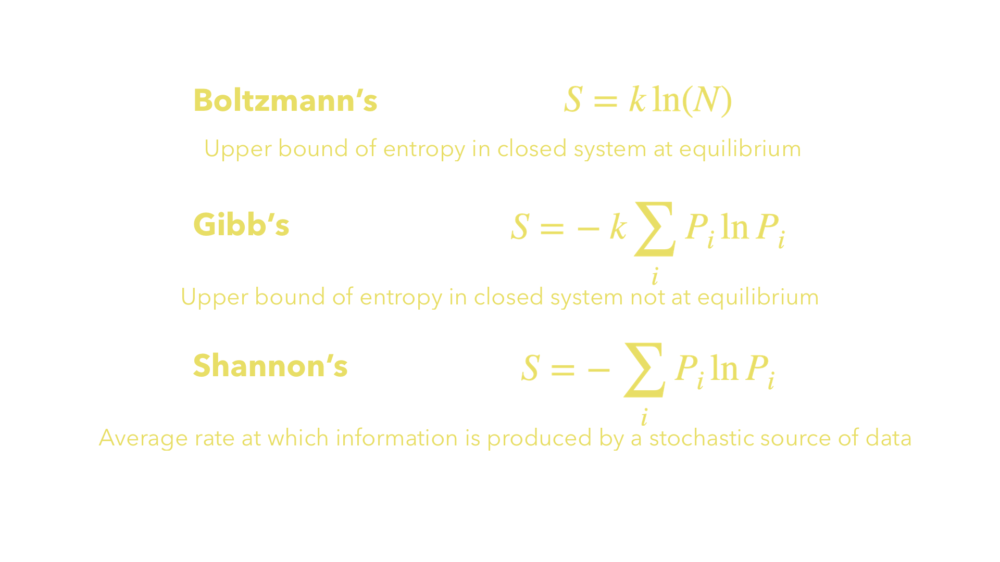

theme: Next, 1
autoscale: true
header-strong: #FFFFFF

# [fit] Insights into **Social Media** Data: 
# [fit] a new formalism inspired in **Thermodynamics**


---

# Agenda


---

# 
# **Background**


^ Provides a clear and comprehensive review and critical appraisal of key literature relevant to the proposed research.

^ Significance of the research is contextualised within the literature presented.

---

# Social Media Usage

* Of the world's ~4.5 billion internet users, almost 3.5 billion use social media<sup>1</sup>
* From 2005-2015 social media usage rose tenfold in the United States alone<sup>2</sup>
* Hundreds of platforms, growing by the year<sup>3</sup>, most use two or more<sup>4</sup>
* Many count users in the millions, with some reaching over a billion users<sup>2</sup>
* Social media usage spans demographics<sup>5</sup>; includes individuals, groups and businesses of all sizes<sup>6</sup>
* Critical to maintaining a competitive edge in business<sup>7</sup>
* Has fundamentally changed the way humanity communicates<sup>8</sup>

---

# Social Media Analysis


---

# Goals

* Understand the network structure of platforms, how people connect (**social network analysis**, **behavioural research**)
* Understand the content being generated and shared among platforms, how people react to and propagate it (**content and sentiment analysis**, **information diffusion theories**)
* Understand where particular interest comes from, the determinants and effects of popular topics (**topic analysis**, **trend analysis**)

---

# Challenges

* Social media generates content of **enormous quantity** at speed<sup>10</sup>
* **Semi-structured** data with **mixed media** necessary to context<sup>11</sup>
* Metadata is sparse + **not always accurate**<sup>12</sup>
* Hardest of **NLP**—jargon, context- + culturally-specific terms<sup>13</sup>
* **Data is harder to get** over time due to platforms commoditising data<sup>14</sup> + increasing privacy controls<sup>15</sup>

---

[.text: #FFFFFF]
[.footer: Cibele Montez Halasz, Senior ML Engineer from Twitter, speaking at Reinforce Conf (Budapest, 2019)]


---

# Trend Analysis & Prediction


---



---

# Why? 

* Optimise marketing and outreach campaigns
* Understand content consumption
* Observe cultural change over time
* Jump on bandwagons
* Prevent impending harmful content trends

---

# Challenges

* Subjectivity of viewing, sharing content
* False positives in anomaly detection-based methods<sup>16</sup>
* Reliance on other information sources in alternative methods<sup>17</sup>
* Timeliness requirements for analysis and detection<sup>18</sup>
* Topic evolution over time<sup>19</sup>
* Predicting the future? 🤔

---

# Multidisciplinary challenges

* Very human data; erratic behaviours (**behavioural science**)
* Sharing between non-fully-connected graph structure... (**graph theory**)
* ...of nodes with varying levels of transmissiveness (**social contagion**)
* Different content and sentiments get shared in different ways (**information diffusion**)

---

# Analogous Application


---

# [fit] Social media analysis 
# [fit] requires some new
# [fit] ways of thinking![^*]

[^*]: see 15, 20-22

---

[.header: text-scale(3)]

# 🤯

---

## Novel cross-disciplinary applications

* Social media trends as contagion theory from **Virology** in Medicine<sup>23 - 25</sup>
* Social media trends as the **Technology Adoption** curve from Information Diffusion Theory<sup>26</sup>
* Social media behaviours observed as sound (**Data Sonification**) to aid in anomaly detection<sup>27</sup>
* Social media network interactions as **Evolutionary Game Theory** from Evolutionary Biology<sup>28</sup>

---

# Entropy Theory


---



---


---


---


---

[.text: #000000]
[.footer: Source: Mahbub, de Souza and Williams 2016]


---

# Entropy over time

* Reveals descriptive statistical measures about a set of data
* But also measures internal diversity and inconsistency
* Takes focus away from upper and lower bounds—or even ranges—in favour of changes in internal distribution that may be more informative
* Is in some cases sufficient to adapt analysis into Markov-model-based prediction

---

# The Gist

* **Social Media** use has swept across the globe, impacting the way we communicate, conduct business and view society
* **Data Analysis** targeting Social Media is seen as important to understanding the opportunities and risks it presents
* Where current methods targeting Social Media have been lacking, some began applying **methods from other fields**
* This study will investigate the feasibility of measures analogous of **Entropy** over time for trend detection, analysis and prediction

---

# 
# **Aims & Objectives**


^ Aims and objectives are concisely elaborated.

^ Original and highly relevant hypotheses or research questions are clearly articulated (if appropriate).

---

# Broadly

1. Can the analogous application of **Entropy Theory** present useful information about the lifetime of a trend or topic on a Social Media platform?
2. Is there indication that the method could be applied more broadly, or adapted to be **predictive**?

---

# In this study

Experimentation aims to confirm the dual hypotheses as follows:

1. **increasing entropy over time** may suggest impending critical interest preceding a trend developing to significance, and
2. **decreasing rate of entropy increase over time** after a high entropy or engagement level has occurred may suggest new evolution in the topic.

---


---


---


---

# Potential **commercial** value

If we can predict changes in topic growth over time, this may aid in early **detection of trends**. 

This may allow parties to release information at points of predicted **optimal reach** or **engagement potential**.

---

# Potential **social research** value

Assuming we can predict trend decay over time if no new stimulus is received, we can identify points where new external stimulus probably was received, even where it is not evident in the platform content.

This can help identify new context or **anomalous trends**.

---

# 
# **Research Design**


^ Presents a clear, comprehensive and appropriate methodology for the research including research philosophy, research strategy and research design.

^ Research design details the approach, the tools and techniques for data collection, collation, analysis, discussion and interpretation (where appropriate) of the research data.

---


# Harvesting from Twitter

---

[.text-emphasis: #FFFFFF]

# Why Twitter?

* Rapid generation of content, rapid decline in interest<sup>17</sup> => *easily observable trends*
* Discrete content size easier to analyse<sup>29</sup> => *more easily verifiable datasets*
* Breadth of functionality in API, well-established tools for research<sup>30</sup> => *easier to get data, perform and recreate studies*


---

# Datasets needed for this study

1. Representing a **single** cohesive topic growing over time
2. Representing a higher-level topic with **multiple** sub-topics or evolution over time

---


---


---


	
---

# Tweet JSON


```json
{
   "created_at":"Fri Feb 10 10:05:45 2017",
   "id_str":"8299945678410624",
   "full_text": "This is a fake Tweet.",
   "user":{
      "id_str": "972937630",
      "name": "John Doe",
      "screen_name": "johndoe",
      "protected": false,
      "verified": false,
   },
   "retweet_count": 167,
   "favorite_count": 50
}
```

---


---

# Why Twarc?

* made by researchers (from the _Documenting the Now_ project)
* many researchers have used it for studies before, establishing its robustness as a tool<sup>31 - 38</sup>
* many have made tools for analysis and visualisation that work with it[^**], so integration issues are not so worrisome

[^**]: examples such as [Twarc Report by Peter Binkley](https://github.com/pbinkley/twarc-report) and [Twarc Cloud by Justin Littman](https://github.com/justinlittman/twarc-cloud)

---


---


---

| File | IDs | Fetched | Lost |
|:---:|:---:|:---:|:---:|
| immigration-exec-order1 | 500,000 | 342,551 | 157,449 |
| immigration-exec-order2 | 500,000 | 341,873 | 158,127 |
| immigration-exec-order3 | 500,000 | 344,425 | 155,575 |
| immigration-exec-order4 | 500,000 | 375,875 | 124,125 |
| immigration-exec-order5 | 500,000 | 364,173 | 135,827 |
| immigration-exec-order6 | 500,000 | 364,605 | 135,395 |
| immigration-exec-order7 | 500,000 | 332,024 | 167,976 |
| ... | ... | ... | ... | 
| **Total** | 16,875,766 | 11,776,307 | 5,099,459 |

---

## seemingly random yet consistent distribution of missing datapoints
## = 
## suitably random self-selecting population sample 👍

---

# Analysis Phase 1: Exploration

* Establish "ground truth" of trend behaviour over time portrayed in each dataset 
* Decide on appropriate granularity for discretisation of data (or justify use of full range of values)
* Explore descriptive statistics to establish theoretical bounds
* Develop strategies for dealing with missing data and edge cases

---

# ⚠️ Issues with historical data

1. Shared tweets show no information about whether likes were given to original or share
2. Engagement metrics are associated with time of posting, even though they would have occurred later and over time

It is assumed that the presence of both effects in **both the test and comparison data** will nullify the effect. 

---


---


---

# [fit] `calculate_entropy(data)`

---

# More Analysis!
# [fit] **Phase 2: Discrete topic**
# &
# [fit] **Phase 3: Evolving topic**

---

# Iterative experimentation


---


## Inferential analysis = 
## dynamic + reponsive

---

## Predictions


* Normal-ish distribution of new tweets
* Varying loglinear to exponential growth rates in engagement
* Engagements between 0 and ~500,000

---

### The Kolmogorov-Smirnov & Cucconi Tests

# 

---

### Regression analysis

# 

---

## Scaling + Transforming


---

## Data Segmentation


---


---

# 
# **Preliminary Findings**
#### **(_very_ preliminary, I only just managed to hydrate a complete dataset on Sunday)**


---

[.background-color: #FFFFFF]
[.text: #000000]


---

# Revisiting hypotheses

I theorised that the patterns to emerge would be two-fold:

1. **increasing** entropy over time **preceding a trend** developing to significance, and
2. **decreasing** rate of entropy increase over time after a high entropy or engagement level **preceding changes in behaviour**.

---

[.background-color: #FFFFFF]
[.text: #000000]


---

# ...maybe that was too easy? 🤔

---

# Where to go next?

1. **Verify and quantify** the appearance of correlation from initial data
2. **Test bounds** of correlation, extensively
3. **Experiment** with different bucketing values, differently weighted engagement metrics
4. **Observe and record** which factors increase or decrease correlation
5. **Repeat** all of the above with another dataset

---

# References

<sup>1</sup> Hootsuite: 2018, Hootsuite’s social media barometer report. [https://hootsuite.com/resources/all-future_of_social-digital_in_2019-glo-en-ca-digital_in_2019-q1_2019](https://hootsuite.com/resources/barometer-2018-global?utm_campaign=all-future_of_social-digital_in_2019-glo-en-ca-digital_in_2019-q1_2019) [Accessed 18 May 2018].
<sup>2</sup> Perrin, A.: 2015, Social media usage: 2005-2015, _PEW Research Center Report_.
<sup>3</sup> Kasemsap, K.: 2019, Professional and business applications of social media platforms, Social Entrepreneurship: Concepts, Methodologies, Tools, and Applications, _IGI Global_, pp. 824– 847.
<sup>4</sup> Zhao, X., Lampe, C. and Ellison, N. B.: 2016, The social media ecology: User perceptions, strategies and challenges, _Proceedings of the 2016 CHI conference on human factors in computing systems_, ACM, pp. 89–100. 
<sup>5</sup> Kane, G. C.: 2015, Enterprise social media: Current capabilities and future possibilities., _MIS Quarterly Executive_ 14(1). 
<sup>6</sup> Kaplan, A. M. and Haenlein, M.: 2010, Users of the world, unite! the challenges and opportunities of social media, _Business horizons_ 53(1), 59–68. 
<sup>7</sup> Chui, M., Manyika, J., Bughin, J., Dobbs, R., Roxburgh, C., Sarrazin, H., Sands, G. and Westergren, M.: 2012, The social economy: Unlocking value and productivity through social technologies. [https://www.mckinsey.com/industries/high-tech/our-insights/ the-social-economy](https://www.mckinsey.com/industries/high-tech/our-insights/ the-social-economy) [Accessed 18 May 2019]. 
<sup>8</sup> Edosomwan, S., Prakasan, S. K., Kouame, D., Watson, J. and Seymour, T.: 2011, The history of social media and its impact on business, _Journal of Applied Management and entrepreneurship_ 16(3), 79–91.
<sup>9</sup> He, W., Shen, J., Tian, X., Li, Y., Akula, V., Yan, G. and Tao, R.: 2015, Gaining competitive intelligence from social media data: evidence from two largest retail chains in the world, _Industrial Management & Data Systems_ 115(9), 1622–1636.
<sup>10</sup> Brooker, P., Barnett, J., Cribbin, T. and Sharma, S.: 2016, Have we even solved the first ‘big data challenge?’practical issues concerning data collection and visual representation for social media analytics, _Digital methods for social science_, Springer, pp. 34–50.
<sup>11</sup> Mayeh, M., Scheepers, R. and Valos, M.: 2012, Understanding the role of social media monitor- ing in generating external intelligence, ACIS 2012: Location, location, location: _Proceedings of the 23rd Australasian Conference on Information Systems 2012_, ACIS, pp. 1–10. 
<sup>12</sup> Halasz, C. M.: 2019, Optimizing training for sparse workloads in Tensorflow. Reinforce AI Conference. **URL**: [https://reinforceconf.com/speaker/CibeleMontezHalasz](https://reinforceconf.com/speaker/CibeleMontezHalasz)
<sup>13</sup> Dou, W., Wang, X., Skau, D., Ribarsky, W. and Zhou, M. X.: 2012, Leadline: Interactive visual analysis of text data through event identification and exploration, _2012 IEEE Conference on Visual Analytics Science and Technology (VAST)_, IEEE, pp. 93–102.
<sup>14</sup> Hogan, B.: 2016, Social media giveth, social media taketh away: Facebook, friendships, and apis, _International Journal of Communication_, Forthcoming. 
<sup>15</sup> Weller, K. and Kinder-Kurlanda, K. E.: 2015, Uncovering the challenges in collection, sharing and documentation: The hidden data of social media research?, _Ninth International AAAI Conference on Web and Social Media_.

---

# References

<sup>16</sup> Altshuler, Y., Pan, W. and Pentland, A. S.: 2012, Trends prediction using social diffusion models, International Conference on Social Computing, _Behavioral-Cultural Modeling and Prediction_, Springer, pp. 97–104.
<sup>17</sup> Sapountzi, A. and Psannis, K. E.: 2018, Social networking data analysis tools & challenges, _Future Generation Computer Systems_ 86, 893–913.
<sup>18</sup> Figueiredo, F., Almeida, J. M., Gon ̧calves, M. A. and Benevenuto, F.: 2016, Trendlearner: Early prediction of popularity trends of user generated content, _Information Sciences_ 349, 172–187. 
<sup>19</sup> Qian, S., Zhang, T., Xu, C. and Shao, J.: 2015, Multi-modal event topic model for social event analysis, _IEEE transactions on multimedia 18(2)_, 233–246.
<sup>20</sup> Manovich, L.: 2011, Trending: The promises and the challenges of big social data, _Debates in the digital humanities_ 2, 460–475. 
<sup>21</sup> Schroeder, R.: 2014, Big data and the brave new world of social media research, _Big Data & 
Society_ 1(2).
<sup>22</sup> Sloan, L. and Quan-Haase, A.: 2017, The SAGE handbook of social media research methods, 
Sage.
<sup>23</sup> Adar, E. and Adamic, L. A.: 2005, Tracking information epidemics in blogspace, Proceedings of the 2005 IEEE/WIC/ACM international conference on web intelligence, _IEEE Computer Society_, pp. 207–214.
<sup>24</sup> Gomez-Rodriguez, M., Leskovec, J. and Krause, A.: 2012, Inferring networks of diffusion and influence, _ACM Transactions on Knowledge Discovery from Data_ (TKDD) 5(4).
<sup>25</sup> Cannarella, J. and Spechler, J. A.: 2014, Epidemiological modeling of online social network dynamics, _arXiv preprint arXiv:1401.4208_.
<sup>26</sup> Chang, H.-C.: 2010, A new perspective on twitter hashtag use: Diffusion of innovation theory, _Proceedings of the American Society for Information Science and Technology_ 47(1), 1–4.
<sup>27</sup> Jamieson, J. and Boase, J.: 2017, Listening to social rhythms: Exploring logged interactional data through sonification, _The SAGE Handbook of Social Media Research Methods_.
<sup>28</sup> Liu, F., Wang, L., Johnson, H. and Zhao, H.: 2015, Analysis of network trust dynamics based on the evolutionary game, Scientia Iranica. Transaction E, _Industrial Engineering_ 22(6). 
<sup>29</sup> Schmidt, C. W.: 2012, Trending now: using social media to predict and track disease outbreaks.
<sup>30</sup> Zimmer, M. and Proferes, N. J.: 2014, A topology of twitter research: disciplines, methods, and ethics, _ASLIB Journal of Information Management_ 66(3), 250–261.

---

# References

<sup>31</sup> Milligan, I., Ruest, N. and Lin, J.: 2016, Content selection and curation for web archiving: The gatekeepers vs. the masses, _Proceedings of the 16th ACM/IEEE-CS on Joint Conference on Digital Libraries_, ACM, pp. 107–110.
<sup>32</sup> Ruest, N. and Milligan, I.: 2016, An open-source strategy for documenting events: The case study of the 42nd canadian federal election on twitter, _Code4Lib_ 32.
<sup>33</sup> Juanals, B. and Minel, J.-L.: 2017, Analysing cultural events on twitter, _International Conference on Computational Collective Intelligence_, Springer, pp. 376–385.
<sup>34</sup> Palmer, A., Robinson, M. and Phillips, K. K.: 2017, Illegal is not a noun: Linguistic form for detection of pejorative nominalizations, _Proceedings of the First Workshop on Abusive Language Online_, pp. 91–100.
<sup>35</sup> Pinter, A. T., Goldman, B. and Novotny, E.: 2017, Pennsylvania perspectives of the 2016 election: A project to collect web and social media content around significant societal events, _Pennsylvania Libraries: Research & Practice_ 5(2), 96–106.
<sup>36</sup> Aruguete, N. and Calvo, E.: 2018, Time to #protest: Selective exposure, cascading activation, and framing in social media, _Journal of Communication_ 68(3), 480–502.
<sup>37</sup> Darwish, K.: 2018, To kavanaugh or not to kavanaugh: That is the polarizing question, _arXiv preprint arXiv:1810.06687_ p. 01.
<sup>38</sup> Kalmar, I., Stevens, C. and Worby, N.: 2018, Twitter, gab, and racism: the case of the soros myth, _Proceedings of the 9th International Conference on Social Media and Society_, ACM, pp. 330–334.
<sup>39</sup> Mahbub, M.S., de Souza, P. and Williams, R., 2017. Describing environmental phenomena variation using entropy theory. _International Journal of Data Science and Analytics_, 3(1), pp.49-60.

---

# [fit] Thank you!


* All images are CC0, Pixabay-licensed or my own
* See **github.com/TheMartianLife/Honours-Presentation**


