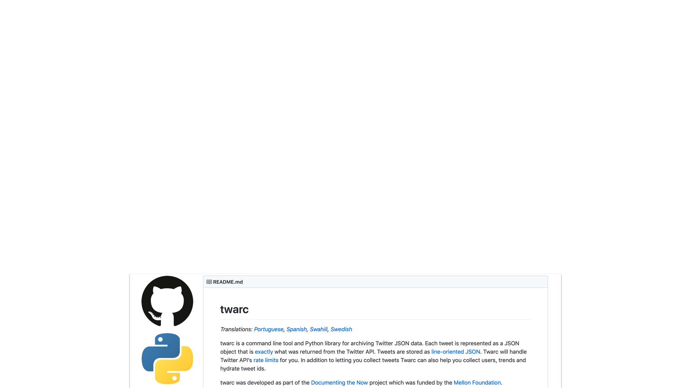

theme: Next, 1
autoscale: true
slidenumbers: true
header-strong: #FFFFFF
footer: A BICT Honours project by Mars Geldard, under the supervision of Professor Paulo de Souza and Dr James Montgomery (2019).

[.slidenumbers: false]
[.hide-footer]

<br>
# [fit] Insights into **Social Media** Data: 
# [fit] a new formalism inspired in **Thermodynamics**
<br>


---

# Overview

A new proposed method for **trend analysis and prediction** with **social media** data that was inspired by the theory of **entropy** from thermodynamics.

Quantitative exploratory study involves calculating **entropy over time** in pre-existing **Twitter** datasets, looking for **two predicted behaviours** as key indicators of feasibility.

---

# Agenda


---

### Background

* Why people care about analysing social media data
* What trend analysis is and why it's so hard
* Why it seems entropy theory might be a good fit

### Aims & Objectives

* Hypotheses for this study
* Where that fits into further investigation that might address practical issues

---

### Research Design

* Breakdown of first phase of study as has been designed, partially undertaken
* Predictions and plans for later phases, subjective to first phase outcomes

### Preliminary Findings 

* What has been done so far
* Where to go from here

---

[.slidenumbers: false]
[.hide-footer]

# 
# **Background**


^ Provides a clear and comprehensive review and critical appraisal of key literature relevant to the proposed research.

^ Significance of the research is contextualised within the literature presented.

---

[.slidenumbers: false]
[.hide-footer]

# Social Media


---

[.slidenumbers: false]
[.hide-footer]

# Social Media Usage

* Hundreds of platforms, growing by the year[^1]
* Some count users in the millions, with the most popular reaching over a billion users[^2]
* From 2005-2015 social media usage rose tenfold in the United States alone[^3]

[^1]: Kasemsap (2019)

[^2]: Kane (2015)

[^3]: Perrin (2015)

---

[.slidenumbers: false]
[.hide-footer]

# Social Media Usage

* Of the ~4.5 billion internet users worldwide, an estimated 3.5 billion are users of social media[^4]
* Social media usage spans demographics[^5]
* Includes both individuals and groups and businesses of all sizes[^6]

[^4]: Hootsuite (2019)

[^5]: Perrin (2015)

[^6]: Kaplan and Haenlein (2010)

---

[.slidenumbers: false]
[.hide-footer]

# Social Media Usage

* Not just one platform; most use two or more[^7]
* Critical to maintaining a competitive edge in business[^8]
* Has fundamentally changed the way humanity communicates[^9]

[^7]: Zhao, Lampe and Ellison (2016)

[^8]: Chui, Manyika, Bughin, Dobbs, Roxburgh, Sarrazin, Sands and Westergren (2012)

[^9]: Edosomwan, Prakasan, Kouame, Watson and Seymour (2011)

---

### "_[Social media has] penetrated deeply into the mechanics of everyday life, affecting people’s informal interactions, as well as institutional structures and professional routines._"
--Van Dijck and Poell (2013)

---

[.slidenumbers: false]
[.hide-footer]

# Social Media Analysis


---

[.slidenumbers: false]
[.hide-footer]

# The Motivation

The **growing use** of and concern about social media—matched by a necessity for their (often free) platform providers to **earn money** and for external parties to **leverage the technology**—has spawned great interest in developing methods to **effectively analyse and gain insight** from its content.[^10]

[^10]: He, Shen, Tian, Li, Akula, Yan and Tao (2015)

---

# The Goals

* Understand the network structure of platforms, how people connect (**social network analysis**, **behavioural research**)
* Understand the content being generated and shared among platforms, how people react to and propagate it (**content and sentiment analysis**, **information diffusion theories**)
* Understand where particular interest comes from, the determinants and effects of popular topics (**topic analysis**, **trend analysis**)

---

[.slidenumbers: false]
[.hide-footer]

# The Challenges

* Social media generates content in **enormous quantity**, at great speed[^11]
* Semi-structured or **unstructed** data with **mixed media** necessary to context[^12]
* Metadata is sparse and **not always accurate**[^13]

[^11]: Brooker, Barnett, Cribbin and Sharma (2016)

[^12]: Mayeh, Scheepers and Valos (2012) and Bello-Orgaz, Jung and Camacho (2016)

[^13]: Halasz (2019)

---

[.slidenumbers: false]
[.hide-footer]

# The Challenges

* Hardest of NLP challenges; full of jargon, context- and culturally-specific terms[^14]
* Data is harder to get over time due to platforms commoditising data[^15] and increasing privacy controls[^16]

[^14]: Dou, Wang, Skau, Ribarsky and Zhou (2012)

[^15]: Hogan (2016) and Felt (2016)

[^16]: Weller and Kinder-Kurlanda (2015)

---

[.slidenumbers: false]
[.text: #FFFFFF]
[.footer: Cibele Montez Halasz, Senior ML Engineer from Twitter, speaking at Reinforce Conf (Budapest, 2019)]


---

[.slidenumbers: false]
[.hide-footer]

# Trend Analysis & Prediction


---


---

# Why?

* Optimise marketing and outreach campaigns
* Understand content consumption
* Observe cultural change over time
* Jump on bandwagons
* Prevent impending harmful content trends

---


---

[.slidenumbers: false]
[.hide-footer]

# Challenges

* Privacy concerns
* False positives in anomaly detection-based methods[^17]
* Reliance on other information sources in alternative methods[^18]

[^17]: Altshuler, Pan and Pentland (2012)

[^18]: Sapountzi and Psannis (2018)

---

[.slidenumbers: false]
[.hide-footer]

# Challenges

* Timeliness requirements for analysis and detection[^19]
* Topic evolution over time[^20]
* Predicting the future? 🤔

[^19]: Figueiredo, Almeida, Goncalves and Benevenuto (2016)

[^20]: Qian, Zhang, Xu and Shao (2015) and Stieglitz, Mirbabaie, Ross and Neuberger (2018)

---

# Multidisciplinary challenges

* Very human data; erratic behaviours (**behavioural science**)
* Sharing between non-fully-connected graph structure... (**graph theory**)
* ...of nodes with varying levels of transmissiveness (**social contagion**)
* Different content and sentiments get shared in different ways (**information diffusion**)


---

[.slidenumbers: false]
[.hide-footer]

# Analogous Application


---

[.footer: *Manovich (2011),  Schroeder (2014), Weller and Kinder-Kurlanda (2015) and Sloan and QuanHaase (2017)]

# [fit] Social media analysis 
# [fit] requires some new
# [fit] ways of thinking!*

---

## Novel applications of cross-disciplinary methods

* Social media trends as contagion theory from **Virology** in Medicine[^21]
* Social media trends as the **Technology Adoption** curve from Information Diffusion Theory[^22]

[^21]: see Adar and Adamic (2005), Gomez-Rodriguez, Leskovec and Krause (2012), Cannarella and Spechler (2014), and more

[^22]: Chang (2010)

---

## Novel applications of cross-disciplinary methods

* Social media behaviours observed as sound (**Data Sonification**) to aid in anomaly detection[^24]
* Social media network interactions as **Evolutionary Game Theory** from Evolutionary Biology[^25]

[^23]: Jamieson and Boase (2017)

[^24]: Liu, Wang, Johnson and Zhao (2015),

---

[.header: text-scale(3)]

# 🤯

---

[.slidenumbers: false]
[.hide-footer]

# Entropy Theory


---

[.slidenumbers: false]
[.hide-footer]

**Others have mentioned the use of entropy theory in social media research before** but 

1. only in  Information Theory[^25], or
2. as applied to analysis of the _network structure_[^26] of a platform community.

[^25]: see Park, Huh, Oh and Han 2012, Matei and Bruno 2015, Tsou 2015, Zhou, Huang, Zhao, Shi, Liang and Fan 2015, speaking of Shannon 1948

[^26]: see Ngoc, Echizen, Komei and Yoshiura 2010, Gao, Shi and Chen 2015, Zhi-Xiao, Ze-chao, Xiao-fang and Jin-hui 2016, and more

---

[.footer: Source: www.thecomputerchurch.org historical collection]


---

## Boltzmann's Entropy

$$
S=k \ln (N)
$$
<br><br><br>

```python
# python equivalent (simplified)
def boltzmann(s):	
    k = scipy.constants.Boltzmann
    n = len(s.possible_microstates)
    return k * math.log(n)
```

---

## Gibb's Entropy

$$
S=-k \sum_{i} P_{i} \ln P_{i}
$$

```python
# python equivalent (simplified)
def gibbs(s):
    k = scipy.constants.Boltzmann
    entropy = 0
    for i in set(s):
        p_i = s.count(i) / len(s.possible_microstates)
        entropy += p_i * math.log(p_i)
    return -k * entropy
```

---

## Shannon's Entropy

$$
S=-\sum_{i} P_{i} \ln P_{i}
$$

```python
# python equivalent (simplified)
def shannon(s):
    entropy = 0
    for i in set(s):
        p_i = s.count(i) / len(s.possible_microstates)
        entropy += p_i * math.log(p_i)
    return -entropy
```

---

[.slidenumbers: false]
[.text: #000000]
[.footer: Source: Mahbub, de Souza and Williams 2016]


---

# Entropy over time

* Reveals descriptive statistical measures about a set of data
* But also measures internal diversity and inconsistency
* Takes focus away from upper and lower bounds—or even ranges—in favour of changes in internal distribution that may be more informative
* Is in some cases sufficient to adapt analysis into Markov-model-based prediction


---

# The Gist

* Social Media use has swept across the globe, impacting the way we communicate, conduct business and view society

* Analysing behaviour on Social Media is seen as important to understanding the opportunities and risks it presents

* Where current methods targeting Social Media have been lacking, a small group of studies have shown varying success in applying methods of analysis from other fields

---

# The Gist

* This study will investigate the feasibility of measures analogous of Entropy over time for trend detection, analysis and prediction

---

[.slidenumbers: false]
[.hide-footer]

# 
# **Aims & Objectives**


^ Aims and objectives are concisely elaborated.

^ Original and highly relevant hypotheses or research questions are clearly articulated (if appropriate).

---

# Broadly

1. Can the analogous application of **Entropy Theory** present useful information about the lifetime of a trend or topic on a Social Media platform?
2. Is there indication that the method could be applied more broadly, or adapted to be **predictive**?

---

# In this study

Experimentation aims to confirm the dual hypotheses as follows:

1. **increasing entropy over time** may suggest impending critical interest preceding a trend developing to significance, and
2. **decreasing rate of entropy increase over time** after a high entropy or engagement level has occurred may suggest new evolution in the topic.

---


---


---


---

# Potential **commercial** value

If we can predict changes in topic growth over time, this may aid in early **detection of trends**. 

This may allow parties to release information at points of predicted **optimal reach** or **engagement potential**.

---

# Potential **social research** value

Assuming we can predict trend decay over time if no new stimulus is received, we can identify points where new external stimulus probably was received, even where it is not evident in the platform content.

This can help identify new context or **anomalous trends**.

---

[.slidenumbers: false]
[.hide-footer]

# 
# **Research Design**


^ Presents a clear, comprehensive and appropriate methodology for the research including research philosophy, research strategy and research design.

^ Research design details the approach, the tools and techniques for data collection, collation, analysis, discussion and interpretation (where appropriate) of the research data.

---

# Two main steps:

## 1. Creating data
## 2. Analysing data

---

[.slidenumbers: false]
[.hide-footer]


# Harvesting from Twitter

---

[.text-emphasis: #FFFFFF]
[.slidenumbers: false]
[.hide-footer]

# Why Twitter?

* Rapid generation of content, rapid decline in interest[^27] => *easily observable trends*
* Discrete content size easier to analyse[^28] => *more easily verifiable datasets*
* Reasonable breadth of functionality in API, well-established tools for research[^29] => *easier to get data, perform and recreate studies*

[^27]: Sapountzi and Psannis 2018

[^28]: Schmidt 2012

[^29]: Zimmer and Proferes 2014

---

# Twitter Content

* Posts of maximum 140 characters (**tweets**)
* Accompanying media of one video or up to four images
* May include hashtags, stock tickers, tagged users
* Metadata includes time of posting, engagements, location
* Sharing of posts can be done verbatim (**retweets**), or with added commentary (**quote tweets**)

---

[.slidenumbers: false]
[.hide-footer]


---

[.slidenumbers: false]
[.hide-footer]


---

# Datasets needed for this study

1. Representing a **single** cohesive topic growing over time
2. Representing a higher-level topic with **multiple** sub-topics or evolution over time

---

[.slidenumbers: false]
[.hide-footer]


---

[.slidenumbers: false]
[.hide-footer]


---

[.slidenumbers: false]
[.hide-footer]



---

[.slidenumbers: false]
[.hide-footer]

# Why Twarc?

* many researchers have used it for studies before, establishing its robustness as a tool[^30]
* many have made tools for analysis and visualisation that work with it[^31], so integration issues are not so worrisome

[^30]: see Milligan, Ruest and Lin 2016, Ruest and Milligan 2016, Juanals and Minel 2017, Palmer, Robinson and Phillips 2017, Pinter, Goldman and Novotny 2017, Aruguete and Calvo 2018, Darwish 2018, Kalmar, Stevens and Worby 2018, and more

[^31]: examples such as [Twarc Report by Peter Binkley](https://github.com/pbinkley/twarc-report) and [Twarc Cloud by Justin Littman](https://github.com/justinlittman/twarc-cloud)

---

[.slidenumbers: false]
[.hide-footer]


---

[.slidenumbers: false]
[.hide-footer]


---

[.slidenumbers: false]
[.hide-footer]

```python
# split.py (simplified)

# create generator function for input file of tweet IDs
def splitter(file, n):
	lines = list(file)
	for i in xrange(0, len(lines), n):
		yield lines[i: i + n]

with open(INPUT_FILENAME,'r') as input_file:
	
	# partition file by given size
	for index, lines in enumerate(splitter(input_file, BATCH_SIZE)):
		batch_filename = OUTPUT_FILENAME + str(index) + '.txt'

		# write each batch to new file
		with open(batch_filename, 'w+') as output_file:
			output_file.write('\n'.join(lines))
```
---


---


---

[.slidenumbers: false]
[.hide-footer]

```python
# hydrate.py (simplified)
import json, twarc

# create generator function for input file of tweet IDs
def tweet_ids():
    for id in open(INPUT_FILENAME):
        yield id

# setup Twarc with API key credentials from created Twitter Developer account
twarc = twarc.Twarc(key, secret, token, token_secret)

# fetch JSON values as dictionary from API with use of hydrate() function
tweets_dict = { 'tweets': [] }
for tweet in twarc.hydrate(tweet_ids):
	tweets_dict['tweets'].append(tweet)

# convert to JSON and write to output file, one line per tweet
with open(OUTPUT_FILENAME,'w+') as output_file:
    json.dump(tweets_dict, output_file)
	
```	
---

# Tweet JSON

```json
{
   "created_at":"Fri Feb 10 10:05:45 +0000 2017",
   "id_str":"8299945678410624",
   "full_text": "This is a fake Tweet because I like to err on the side of privacy.",
   "user":{
      "id_str": "972937630",
      "name": "John Doe",
      "screen_name": "johndoe",
      "protected": false,
      "verified": false,
   },
   "retweet_count": 167,
   "favorite_count": 50
}
```

---

| File | IDs | Hydrated | Lost |
|:---:|:---:|:---:|:---:|
| immigration-exec-order1 | 500,000 | 342,551 | 157,449 |
| immigration-exec-order2 | 500,000 | 341,873 | 158,127 |
| immigration-exec-order3 | 500,000 | 344,425 | 155,575 |
| immigration-exec-order4 | 500,000 | 375,875 | 124,125 |
| immigration-exec-order5 | 500,000 | 364,173 | 135,827 |
| immigration-exec-order6 | 500,000 | 364,605 | 135,395 |
| immigration-exec-order7 | 500,000 | 332,024 | 167,976 |
| ... | ... | ... | ... | 
| **Total** | 16,875,766 | 11,776,307 | 5,099,459 |

---

## seemingly random yet consistent distribution of missing datapoints
## = 
## suitably random self-selecting population sample 👍

---


[.slidenumbers: false]
[.hide-footer]

```python
# tweets.py (simplified)
import csv, jsonl
from classes import Tweet

headers = ['id', 'likes', 'retweets', 
	'retweeted_id', 'quoted_id', 'timestamp']

with open(INPUT_FILENAME, 'r') as input_file:
	output_file = open(OUTPUT_FILENAME,'w+')
	csv_writer = csv.writer(output_file, delimiter=',')
	csv_writer.writerow(headers)

	for line in input_file:
		tweet = Tweet(line)
		csv_writer.writerow(tweet.values())
	output_file.close()
```

---


---

[.slidenumbers: false]
[.hide-footer]

```python
# classes.py (simplified)
import json

class Tweet():

	def __init__(self, tweet_object):
        	tweet_json = json.loads(tweet_object)

        	self.id = int(tweet_json["id_str"])
        	self.likes = int(tweet_json["favorite_count"])
        	self.retweets = int(tweet_json["retweet_count"])
        	self.timestamp = self.process_datetime(tweet_json["created_at"])

        	# RETWEET
        	if "retweeted_status" in tweet_json:
            		self.retweeted_id = int(tweet_json["retweeted_status"]["id_str"])
            		self.likes = int(tweet_json["retweeted_status"]["favorite_count"])

        	# QUOTE TWEET
        	if "quoted_status" in tweet_json:
            		self.quoted_id = int(tweet_json["quoted_status_id"])
```

---

# Phase 1: Exploration

* Establish "ground truth" of trend behaviour over time portrayed in each dataset 
* Decide on appropriate granularity for discretisation of data (or justify use of full range of values)
* Explore descriptive statistics to establish theoretical bounds
* Develop strategies for dealing with missing data and edge cases

---

# ⚠️ Issues

1. Retweeted tweets show no information about whether likes were given to original or retweet
2. Engagement metrics are associated with time of posting, even though they would have occurred later and over time

---

# ⚠️ Issues

It is assumed that the presence of both effects in **both the test and comparison data** will nullify the effect. 

*But* this study can only assert indicative suitability for historical data until verified with a live study.

---

[.slidenumbers: false]
[.hide-footer]


---

[.slidenumbers: false]
[.hide-footer]

```python
# collate.py (simplified)
with open(INPUT_FILENAME, "r") as input_file:
	csv_reader = csv.reader(input_file, delimiter=',')
	output_files = {}

	for line_number, line in enumerate(csv_reader):
		date = line[5][0:10] # YYYY-MM-DD

		if date not in output_files:
			new_filename = OUTPUT_FILENAME + "-" + date + ".csv"
			output_files[date] = open(new_filename,"a+")

		output_file = output_files[date]
		output_file.write(",".join(line) + '\n')

for file_handle in output_files.keys():
	file_handle.close()
```
---


---

[.slidenumbers: false]
[.hide-footer]

```python
# entropy.py (simplified example)
import csv, bumpy

output_file = open(OUTPUT_FILENAME, 'w+')
csv_writer = csv.writer(output_file, delimiter=',')
cumulative_likes = 0
likes = []

for input_filename in INPUT_FILENAMES:
	input_file = open(input_filename, 'r')
	csv_reader = csv.reader(input_file, delimiter=',')

	likes += [float(row[1]) for row in csv_reader]
	date = input_filename[23:33] # YYYY-MM-DD
	cumulative_likes += numpy.sum(likes)
	csv_writer.writerow([date, str(entropy(likes)), str(cumulative_likes)])

	input_file.close()

output_file.close()
```

---

# [fit] Phase 2: Discrete topic
# &
# [fit] Phase 3: Evolving topic

---

# Iterative experimentation


---

[.slidenumbers: false]
[.hide-footer]


## Inferential analysis = 
## dynamic + reponsive

---

## Predictions


* Normal-ish distribution of new tweets
* Varying loglinear to exponential growth rates in engagement
* Engagements between 0 and ~500,000

---

### The Kolmogorov-Smirnov & Cucconi Tests

# 

---

### Regression analysis

# 

---

[.slidenumbers: false]
[.hide-footer]

## Scaling + Transforming


---

[.slidenumbers: false]
[.hide-footer]

## Data Segmentation


---

[.slidenumbers: false]
[.hide-footer]


---

[.slidenumbers: false]
[.hide-footer]

# 
# **Preliminary Findings**
#### **(_very_ preliminary, I only just managed to hydrate a complete dataset on Sunday)**


---

[.background-color: #FFFFFF]
[.text: #000000]


---

# Revisiting hypotheses

I theorised that the patterns to emerge would be two-fold:

1. **increasing** entropy over time **preceding a trend** developing to significance, and
2. **decreasing** rate of entropy increase over time after a high entropy or engagement level **preceding changes in behaviour**.

---

[.background-color: #FFFFFF]
[.text: #000000]


---

# ...maybe that was too easy? 🤔

---

# Where to go next?

1. **Verify and quantify** the appearance of correlation from initial data
2. **Test bounds** of correlation, extensively
3. **Experiment** with different bucketing values, differently weighted engagement metrics
4. **Observe and record** which factors increase or decrease correlation
5. **Repeat** all of the above with another dataset

---

# References

* Adar, E. and Adamic, L. A.: 2005, Tracking information epidemics in blogspace, Proceedings of the 2005 IEEE/WIC/ACM international conference on web intelligence, _IEEE Computer Society_, pp. 207–214. 
* Altshuler, Y., Pan, W. and Pentland, A. S.: 2012, Trends prediction using social diffusion models, International Conference on Social Computing, _Behavioral-Cultural Modeling and Prediction_, Springer, pp. 97–104. 
* Aruguete, N. and Calvo, E.: 2018, Time to #protest: Selective exposure, cascading activation, and framing in social media, _Journal of Communication_ 68(3), 480–502.
* Bello-Orgaz, G., Jung, J. J. and Camacho, D.: 2016, Social big data: Recent achievements and new challenges, _Information Fusion_ 28, 45–59. 
* Cannarella, J. and Spechler, J. A.: 2014, Epidemiological modeling of online social network dynamics, _arXiv preprint arXiv:1401.4208_. 
* Chang, H.-C.: 2010, A new perspective on twitter hashtag use: Diffusion of innovation theory, _Proceedings of the American Society for Information Science and Technology_ 47(1), 1–4. 
* Chui, M., Manyika, J., Bughin, J., Dobbs, R., Roxburgh, C., Sarrazin, H., Sands, G. and Westergren, M.: 2012, The social economy: Unlocking value and productivity through social technologies. [https://www.mckinsey.com/industries/high-tech/our-insights/ the-social-economy](https://www.mckinsey.com/industries/high-tech/our-insights/ the-social-economy) [Accessed 18 May 2019]. 
* Darwish, K.: 2018, To kavanaugh or not to kavanaugh: That is the polarizing question, _arXiv preprint arXiv:1810.06687_ p. 01.
* Dou, W., Wang, X., Skau, D., Ribarsky, W. and Zhou, M. X.: 2012, Leadline: Interactive visual analysis of text data through event identification and exploration, _2012 IEEE Conference on Visual Analytics Science and Technology (VAST)_, IEEE, pp. 93–102. 
* Edosomwan, S., Prakasan, S. K., Kouame, D., Watson, J. and Seymour, T.: 2011, The history of social media and its impact on business, _Journal of Applied Management and entrepreneurship_ 16(3), 79–91.
* Felt, M.: 2016, Social media and the social sciences: How researchers employ big data analytics, _Big Data & Society_ 3(1).  
* Figueiredo, F., Almeida, J. M., Gon ̧calves, M. A. and Benevenuto, F.: 2016, Trendlearner: Early prediction of popularity trends of user generated content, _Information Sciences_ 349, 172–187. 
* Gao, Z., Shi, Y. and Chen, S.: 2015, Measures of node centrality in mobile social networks, _International Journal of Modern Physics_ C 26(09).
* Gomez-Rodriguez, M., Leskovec, J. and Krause, A.: 2012, Inferring networks of diffusion and influence, _ACM Transactions on Knowledge Discovery from Data_ (TKDD) 5(4). 
* Halasz, C. M.: 2019, Optimizing training for sparse workloads in Tensorflow. Reinforce AI Conference. **URL**: [https://reinforceconf.com/speaker/CibeleMontezHalasz](https://reinforceconf.com/speaker/CibeleMontezHalasz)

---

# References

* He, W., Shen, J., Tian, X., Li, Y., Akula, V., Yan, G. and Tao, R.: 2015, Gaining competitive intelligence from social media data: evidence from two largest retail chains in the world, _Industrial Management & Data Systems_ 115(9), 1622–1636.
* Hogan, B.: 2016, Social media giveth, social media taketh away: Facebook, friendships, and apis, _International Journal of Communication_, Forthcoming. 
* Hootsuite: 2018, Hootsuite’s social media barometer report. [https://hootsuite.com/resources/all-future_of_social-digital_in_2019-glo-en-ca-digital_in_2019-q1_2019](https://hootsuite.com/resources/barometer-2018-global?utm_campaign=all-future_of_social-digital_in_2019-glo-en-ca-digital_in_2019-q1_2019) [Accessed 18 May 2018]. 
* Jamieson, J. and Boase, J.: 2017, Listening to social rhythms: Exploring logged interactional data through sonification, _The SAGE Handbook of Social Media Research Methods_.
* Juanals, B. and Minel, J.-L.: 2017, Analysing cultural events on twitter, _International Conference on Computational Collective Intelligence_, Springer, pp. 376–385.
* Kalmar, I., Stevens, C. and Worby, N.: 2018, Twitter, gab, and racism: the case of the soros myth, _Proceedings of the 9th International Conference on Social Media and Society_, ACM, pp. 330–334.
* Kane, G. C.: 2015, Enterprise social media: Current capabilities and future possibilities., _MIS Quarterly Executive_ 14(1). 
* Kaplan, A. M. and Haenlein, M.: 2010, Users of the world, unite! the challenges and opportunities of social media, _Business horizons_ 53(1), 59–68. 
* Kasemsap, K.: 2019, Professional and business applications of social media platforms, Social Entrepreneurship: Concepts, Methodologies, Tools, and Applications, _IGI Global_, pp. 824– 847.
* Liu, F., Wang, L., Johnson, H. and Zhao, H.: 2015, Analysis of network trust dynamics based 
on the evolutionary game, Scientia Iranica. Transaction E, _Industrial Engineering_ 22(6).  
* Mahbub, M.S., de Souza, P. and Williams, R., 2017. Describing environmental phenomena variation using entropy theory. _International Journal of Data Science and Analytics_, 3(1), pp.49-60.
* Mahbub, M.S., de Souza, P. and Williams, R., 2019. Understanding Environmental Changes Using Statistical Mechanics. _Annals of Data Science_, pp.1-13.
* Manovich, L.: 2011, Trending: The promises and the challenges of big social data, _Debates in the digital humanities_ 2, 460–475. 
* Matei, S. A. and Bruno, R. J.: 2015, Pareto’s 80/20 law and social differentiation: A social entropy perspective, _Public Relations Review_ 41(2), 178–186.
* Mayeh, M., Scheepers, R. and Valos, M.: 2012, Understanding the role of social media monitor- ing in generating external intelligence, ACIS 2012: Location, location, location: _Proceedings of the 23rd Australasian Conference on Information Systems 2012_, ACIS, pp. 1–10. 
* Milligan, I., Ruest, N. and Lin, J.: 2016, Content selection and curation for web archiving: The gatekeepers vs. the masses, _Proceedings of the 16th ACM/IEEE-CS on Joint Conference on Digital Libraries_, ACM, pp. 107–110.

---

# References

* Ngoc, T. H., Echizen, I., Komei, K. and Yoshiura, H.: 2010, New approach to quantification of privacy on social network sites, 2010 24th _IEEE International Conference on Advanced Information Networking and Applications_, IEEE, pp. 556–564.
* Park, S.-H., Huh, S.-Y., Oh, W. and Han, S. P.: 2012, A social network-based inference model for validating customer profile data., _MIS quarterly_ 36(4).
* Perrin, A.: 2015, Social media usage: 2005-2015, _PEW Research Center Report_. 
* Pinter, A. T., Goldman, B. and Novotny, E.: 2017, Pennsylvania perspectives of the 2016 election: A project to collect web and social media content around significant societal events, _Pennsylvania Libraries: Research & Practice_ 5(2), 96–106.
* Qian, S., Zhang, T., Xu, C. and Shao, J.: 2015, Multi-modal event topic model for social event analysis, _IEEE transactions on multimedia 18(2)_, 233–246. 
* Ruest, N. and Milligan, I.: 2016, An open-source strategy for documenting events: The case study of the 42nd canadian federal election on twitter, _Code4Lib_ 32.
* Sapountzi, A. and Psannis, K. E.: 2018, Social networking data analysis tools & challenges, _Future Generation Computer Systems_ 86, 893–913.
* Schmidt, C. W.: 2012, Trending now: using social media to predict and track disease outbreaks.
* Schroeder, R.: 2014, Big data and the brave new world of social media research, _Big Data & 
Society_ 1(2).
* Sloan, L. and Quan-Haase, A.: 2017, The SAGE handbook of social media research methods, 
Sage.
* Stieglitz, S., Mirbabaie, M., Ross, B. and Neuberger, C.: 2018, Social media analytics–challenges in topic discovery, data collection, and data preparation, _International journal of information management_ 39, 156–168. 
* Tsou, M.H., 2015. Research challenges and opportunities in mapping social media and Big Data. _Cartography and Geographic Information Science_, 42(sup1), pp.70-74.
* Van Dijck, J. and Poell, T.: 2013, Understanding social media logic, _Media and communication_ 1(1), 2–14. 
* Weller, K. and Kinder-Kurlanda, K. E.: 2015, Uncovering the challenges in collection, sharing and documentation: The hidden data of social media research?, _Ninth International AAAI Conference on Web and Social Media_. 
* Zhao, X., Lampe, C. and Ellison, N. B.: 2016, The social media ecology: User perceptions, strategies and challenges, _Proceedings of the 2016 CHI conference on human factors in computing systems_, ACM, pp. 89–100. 
* Zhi-Xiao, W., Ze-chao, L., Xiao-fang, D. and Jin-hui, T.: 2016, Overlapping community detection based on node location analysis, _Knowledge-Based Systems_ 105, 225–235.
* Zhou, F., Huang, W., Zhao, Y., Shi, Y., Liang, X. and Fan, X.: 2015, Entvis: a visual analytic tool for entropy-based network traffic anomaly detection, _IEEE Computer Graphics and Applications_ 35(6), 42–50.
* Zimmer, M. and Proferes, N. J.: 2014, A topology of twitter research: disciplines, methods, and ethics, _ASLIB Journal of Information Management_ 66(3), 250–261.

---

[.slidenumbers: false]
[.hide-footer]

# [fit] Thank you!


* All images are CC0, Pixabay-licensed or my own
* See **github.com/TheMartianLife/Honours-Presentation**


---

[.background-color: #FF0000]
[.text: #000000]
[.header: #000000]

### more slides will go here with visualisations of answers to questions that friends ask me when rehearsing
### (that I can't justify or fit in the main presentation)
